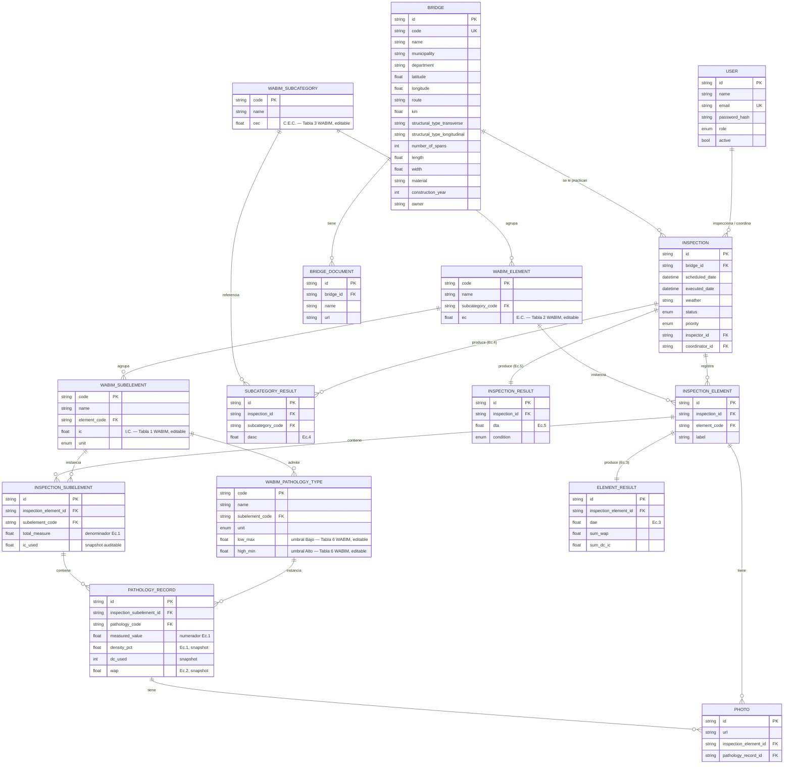

# Modelo Entidad-Relación (ERD) — WABIM Bridges

Este diagrama corresponde al esquema PostgreSQL objetivo (`prisma/schema.prisma` /
`sql/postgresql_schema.sql`). La demostración en este entregable usa un espejo
funcional en SQLite (`src/db/schema.sql`) por no tener acceso a internet en el
entorno de generación (ver `README.md`, sección "Nota sobre el entorno").

## Notas de diseño

* **Catálogo vs. captura de campo**: las tablas `wabim_*` son el *catálogo*
  (definiciones y coeficientes configurables). Las tablas `inspection_*` y
  `pathology_records` son la *captura de campo* (instancias reales medidas en
  una inspección concreta). Esta separación permite que el administrador
  recalibre coeficientes sin perder ni alterar el historial de inspecciones
  ya calculadas.
* **Trazabilidad / auditoría**: cada patología registrada guarda un
  "snapshot" del I.C., del rango D.C. usado y del resultado (`density_pct`,
  `dc_used`, `wap`) en el momento del cálculo. Igual para `element_results`
  (E.C. usado, D.A.E.) y `subcategory_results` (C.E.C. usado, D.A.S.C.). Así,
  cambiar un coeficiente en el catálogo **no** altera retroactivamente
  inspecciones ya calculadas — solo afecta a los cálculos que se ejecuten
  después del cambio.
* **Extensibilidad**: el modelo está preparado para anexar módulos futuros
  (BIM, procesamiento de imágenes con IA, drones) agregando nuevas tablas
  relacionadas por `inspection_id` / `bridge_id` sin tocar el núcleo WABIM.
